# MineCrafteos
**Índice**

1. [Introducción](#id1)

2. [Manual técnico para desarrolladores](#id2)

	2.1 [Requisitos previos](#id2.1)

	2.2 [Estructura](#id2.2)

	2.3 [Base de Datos]()

	2.4 [Metodología](#id2.4)

	2.5 [Ejecución del proyecto](#id2.5)

	2.6 [Manejo de errores](#id2.6)

4. [Manual de usuario](#id3)

5. [Reparto de tareas](#id4)

6. [Mejoras](#id5)

7. [Conclusiones](#id6)

8. [Autores](#id7)

## Introducción<a name="id1"></a>

Nuestra aplicación recoge datos de una base de datos de objetos de minecraft, y nos da información sobre ellos, como son el nombre, su imagen y su modo de obtención.

Nos permite tambien crear objetos, añadiendolos a la base de datos, pero habiendose registrado el usuario previamente en la aplicación y teniendo la sesión iniciada.


El proyecto ha sido desarrollado como parte del módulo de **Acceso a Datos** de 2º de DAM, aplicando conceptos como:

- Arquitectura MVC.
- Persistencia de datos.
- Acceso a base de datos mediante JDBC.
- Manejo de errores.
- Programación orientada a objetos.


## Manual técnico para desarrolladores<a name="id2"></a>

### Requisitos previos<a name="id2.1"></a>

- El proyecto se ha desarrollado usando **Java SE 17**, usando **ANT** por lo tanto necesitaremos una versión igual o superior para poder ejecutarlo.
- **NetBeans** ha sido el IDE usado para su desarrollo.
- Es necesario disponer de una base de datos **MySQL** con los datos de los objetos.   
  El programa usa un **conector JDBC** para la conexión con la base de datos  

### Estructura<a name="id2.2"></a>

El proyecto está planteado siguiendo el patrón MVC (Modelo-Vista-Controlador), sin embargo hemos necesitado de añadir servicios para gestionar la conexión con la base de datos y el acceso a los mismos.

Nuestro proyecto cuenta con los siguientes paquetes:

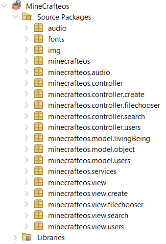

Estes son los recursos que usamos para el programa.

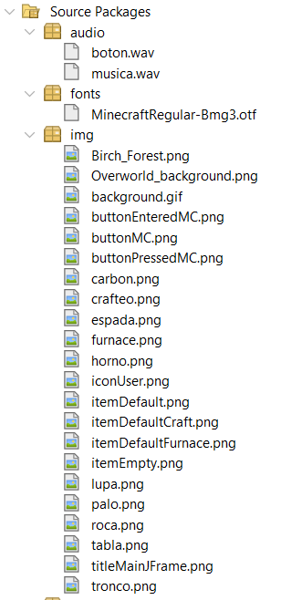

Estas son nuestras clases.

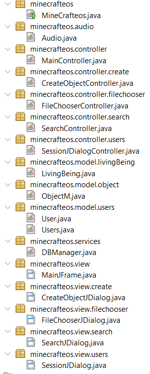

Estas son las librerías que empleamos.

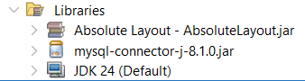


#### Modelo

El modelo contiene los datos del programa y define cómo estos deben ser manipulados, es decir, contiene la lógica que se necesita para gestionar el estado y las reglas del negocio. Interactúa respondiendo a las solicitudes del controlador para acceder o actualizar los datos. Notifica indirectamente a la vista cuando los datos han cambiado para que se actualice la presentación.

#### Controlador

El controlador recibe las entradas del usuario desde la vista y las traduce en acciones que el modelo debe ejecutar. Se encarga de interpretar las acciones del usuario, manejar los eventos, y de actualizar tanto el modelo como la vista.

#### Vista

Se encarga de la visualización de los datos del modelo de manera que el usuario los entienda. No contiene lógica de negocio, solo muestra lo que el modelo le proporciona.. La vista recibe entradas del usuario (clics, teclas, etc.) y las envía al controlador.

#### Servicio

Se encarga de gestionar la conexión con la base de datos, así como de realizar el CRUD entre el programa y ella.

Como codigo reseñable añadimos la clase BDManager

```java

```

### Base de datos<a name="id2.3"></a>

Script de la base de datos

```sql
/* =========================
   BASE DE DATOS
   ========================= */
DROP DATABASE IF EXISTS minecraft;
CREATE DATABASE minecraft;
USE minecraft;

/* =========================
   TABLAS
   ========================= */

CREATE TABLE usuario (
    ID INT AUTO_INCREMENT PRIMARY KEY,
    nombre VARCHAR(25) NOT NULL,
    contrasenha VARCHAR(25) NOT NULL
);

CREATE TABLE ser_vivo (
    ID INT AUTO_INCREMENT PRIMARY KEY,
    nombre VARCHAR(25) NOT NULL,
    ubicacion VARCHAR(25) NOT NULL,
    tipo VARCHAR(15) NOT NULL
);

CREATE TABLE objeto (
    ID INT AUTO_INCREMENT PRIMARY KEY,
    ID_objeto INT,
    ID_usuario INT NOT NULL,
    nombre VARCHAR(25) NOT NULL,
    tipo VARCHAR(25) NOT NULL,
    picable BOOLEAN NOT NULL,
    cosechable BOOLEAN NOT NULL,
    matable BOOLEAN NOT NULL,
    horneable BOOLEAN NOT NULL,
    crafteable BOOLEAN NOT NULL,
    imagen VARCHAR(100) NOT NULL
);

CREATE TABLE cosecha (
    ID_ser_vivo INT,
    ID_objeto INT,
    PRIMARY KEY (ID_ser_vivo, ID_objeto)
);

CREATE TABLE mata (
    ID_ser_vivo INT,
    ID_objeto INT,
    PRIMARY KEY (ID_ser_vivo, ID_objeto)
);

CREATE TABLE forma (
    ID_objeto_crafteable INT,
    ID_objeto INT,
    posicion INT NOT NULL CHECK (posicion BETWEEN 0 AND 8),
    PRIMARY KEY (ID_objeto_crafteable, ID_objeto, posicion)
);

/* =========================
   CLAVES AJENAS
   ========================= */

ALTER TABLE objeto
ADD CONSTRAINT fk_objeto_resultado
FOREIGN KEY (ID_objeto) REFERENCES objeto(ID),
ADD CONSTRAINT fk_objeto_usuario
FOREIGN KEY (ID_usuario) REFERENCES usuario(ID);

ALTER TABLE cosecha
ADD CONSTRAINT fk_cosecha_ser
FOREIGN KEY (ID_ser_vivo) REFERENCES ser_vivo(ID),
ADD CONSTRAINT fk_cosecha_objeto
FOREIGN KEY (ID_objeto) REFERENCES objeto(ID);

ALTER TABLE mata
ADD CONSTRAINT fk_mata_ser
FOREIGN KEY (ID_ser_vivo) REFERENCES ser_vivo(ID),
ADD CONSTRAINT fk_mata_objeto
FOREIGN KEY (ID_objeto) REFERENCES objeto(ID);

ALTER TABLE forma
ADD CONSTRAINT fk_forma_resultado
FOREIGN KEY (ID_objeto_crafteable) REFERENCES objeto(ID),
ADD CONSTRAINT fk_forma_material
FOREIGN KEY (ID_objeto) REFERENCES objeto(ID);

/* =========================
   DATOS
   ========================= */

INSERT INTO usuario (nombre, contrasenha)
VALUES ('Steve', '1234');

INSERT INTO ser_vivo (nombre, ubicacion, tipo)
VALUES ('Árbol', 'Bosque', 'Planta');

/* =========================
   OBJETOS
   ========================= */

INSERT INTO objeto
(ID_objeto, ID_usuario, nombre, tipo,
 picable, cosechable, matable, horneable, crafteable, imagen)
VALUES
-- Materiales
(NULL, 1, 'Tronco de roble', 'Material',
 FALSE, TRUE, FALSE, FALSE, FALSE, '/img/tronco.png'),

(NULL, 1, 'Tabla de roble', 'Material',
 FALSE, FALSE, FALSE, FALSE, TRUE, '/img/tabla.png'),

(NULL, 1, 'Palo', 'Material',
 FALSE, FALSE, FALSE, FALSE, TRUE, '/img/palo.png'),

(NULL, 1, 'Roca', 'Material',
 TRUE, FALSE, FALSE, FALSE, FALSE, '/img/roca.png'),

(NULL, 1, 'Carbón', 'Material',
 TRUE, FALSE, FALSE, FALSE, FALSE, '/img/carbon.png'),

-- Herramientas / bloques
(NULL, 1, 'Espada de madera', 'Herramienta',
 FALSE, FALSE, FALSE, FALSE, TRUE, '/img/espada.png'),

(NULL, 1, 'Horno', 'Bloque',
 FALSE, FALSE, FALSE, FALSE, TRUE, '/img/horno.png');

/* =========================
   COSECHA
   ========================= */

-- Árbol → Tronco
INSERT INTO cosecha (ID_ser_vivo, ID_objeto)
VALUES (1, 1);

/* =========================
   HORNEADO
   ========================= */

-- Tronco → Carbón (carbón se obtiene horneando tronco)
UPDATE objeto
SET ID_objeto = 5
WHERE ID = 1;

/* =========================
   CRAFTEOS (3x3)
   ========================= */

-- TABLAS
INSERT INTO forma VALUES
(2, 1, 4);

-- PALOS
INSERT INTO forma VALUES
(3, 2, 1),
(3, 2, 4);

-- ESPADA DE MADERA
INSERT INTO forma VALUES
(6, 2, 1),
(6, 2, 4),
(6, 3, 7);

-- HORNO
INSERT INTO forma VALUES
(7, 4, 0),
(7, 4, 1),
(7, 4, 2),
(7, 4, 3),
(7, 4, 5),
(7, 4, 6),
(7, 4, 7),
(7, 4, 8);

```
Modelos Entidad-Relación y Relacional

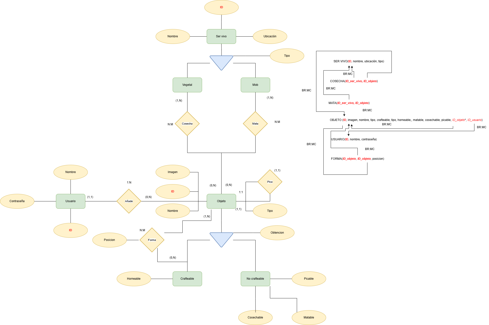


### Metodología<a name="id2.4"></a>

El desarrollo del proyecto se realizó siguiendo una metodología incremental:

1. Análisis del problema.  
2. Diseño de la arquitectura.  
3. Implementación del modelo.  
4. Creación de la interfaz gráfica.  
5. Desarrollo de controladores.  
6. Implementación de la base de datos.  
7. Integración.  
8. Pruebas.  
9. Documentación.  

Se utilizó **Git** como sistema de control de versiones.

---

### Ejecución del proyecto<a name="id2.5"></a>

Desde NetBeans:

1. Abrir NetBeans.  
2. File → Open Project.  
3. Seleccionar la carpeta del proyecto.  
4. Configurar JDK 17.  
5. Configurar el driver JDBC.  
6. Ejecutar la clase `Main`.  

Desde terminal (si se genera JAR):

```bash
java -jar MineCrafteos.jar
```

### Manejo de errores<a name="id2.6"></a>

Los errores de sql se manejan en la clase DBManager, usando try-catch y excepciones.

Los errores de introduccion de datos por parte del usuario, se manejan en los controladores, empleando recursos como JOptionPane.

## Manual de usuario<a name="id3"></a>

Al iniciar la aplicación nos encontraremos con la página de inicio.

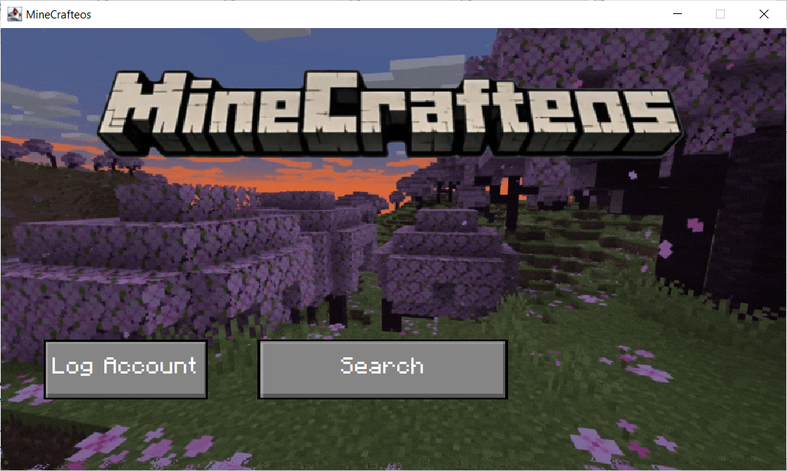

Una vez dentro, pulsamos el boton de log in, introduciremos el nombre de usuario y la contraseña que el usuario desee.

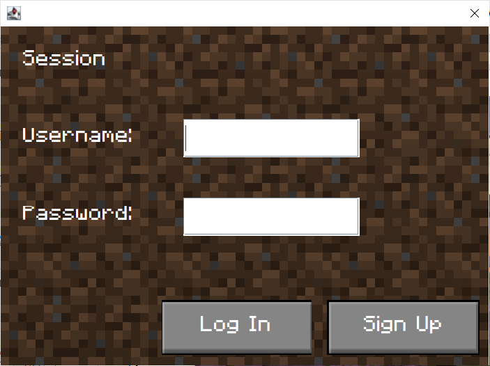

Para poder crear la cuenta, los dos campos deben estar rellenados, y el usuario no debe existir previamente.

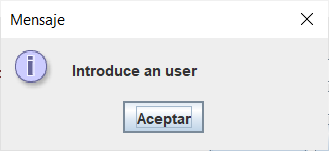

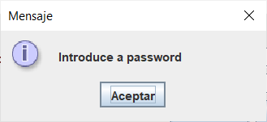


Para iniciar sesión, introduciremos un usuario existente así como su contraseña, y pulsamos el botón de iniciar sesión.

Para iniciar sesión es necesario que el usuario exista, y que la contraseña que introduzcamos sea la que está relacionada con ese usuario. 

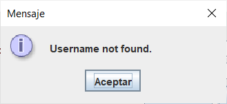

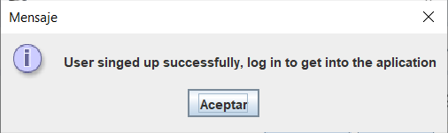

Con la sesión iniciada, esta será nuestra pantalla de inicio

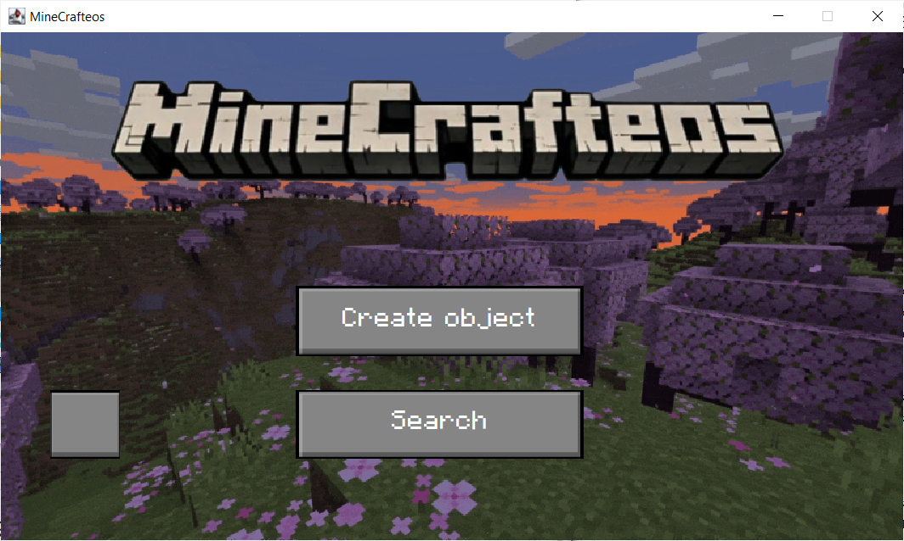

Si pulsamos el boton search, se nos abrira una ventana de búsqueda.

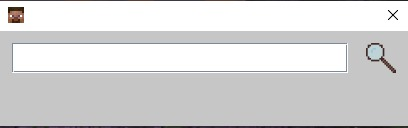

Si buscamos un objeto, nos aparecerá su crafteo

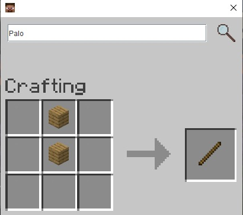
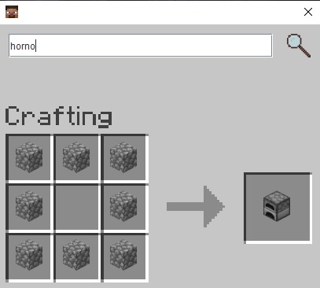


## Reparto de tareas<a name="id4"></a>

- Conjuntamente, concretamos el pliego del proyecto, así como las ideas generales de la base de datos y la creación de los modelos.
- Axel(25 horas)
  - Realización de la vista principal, vista de buscar objeto, e implementación de imágenes, así como elaboración e implementación del gif la ventana de inicio.
- Carlos(25 horas)
	- Pulido de modelos ER y Relacional, realización del script de la base de datos, creación e implementación del servicio de conexión con la base de datos y creacion e implementación de la gestión de los usuarios, elaboración de readme.
- Breogán(25 horas)
  - Vista y lógica de la creación de objetos y manejo de errores, así como la integración de la vista de los usuarios con la estética del programa, y el completado del servicio de la base de datos.

## Mejoras <a name="id5"></a>
* Concretar numero de objetos resultantes de un crafteo


## Conclusiones<a name="id6"></a>

## Autores<a name="id7"></a>

Axel Torreiro Lodeiro

Breogan Fontenla Rosende

José Carlos Domínguuez Figueiras
